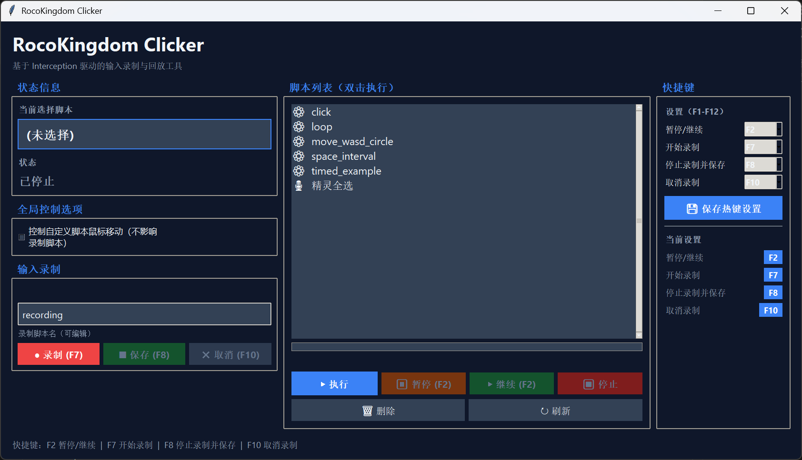
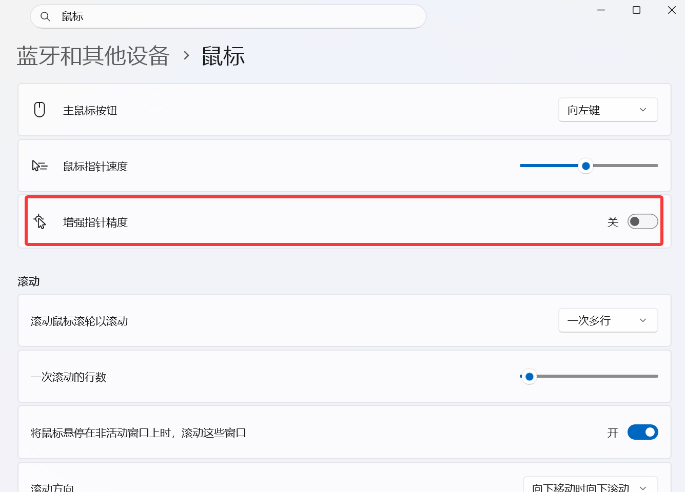

# RocoKingdom 连点器（RocoKingdom Clicker）

本项目用于在《洛克王国：世界》中自动执行重复、固定的鼠标/按键动作，以减少玩家手动重复操作的负担。

> 请注意：使用自动化工具存在被封禁的风险，使用者须自行承担风险与后果。

## 启动与运行

### 前置步骤

只需要安装一次 Interception 驱动（仓库已附带编译好的 DLL 与安装程序，**不需要自己安装 WDK 或编译 DLL**）。按照 [驱动安装说明](docs/DRIVER_INSTALLATION.md) 操作即可。

### 使用发布包运行

下载并解压发布包后，先以管理员身份运行包内 `driver_installer\install-interception.exe /install`（首次需要，详见 [驱动安装说明](docs/DRIVER_INSTALLATION.md)），然后双击 `run_clicker.vbs` 启动。该 VBS 会在需要时弹出 UAC 提示以提升权限，确认后程序以静默窗口（无控制台）方式运行，适合普通最终用户。

### 开发与调试（源码运行）

当你需要修改代码、调试或查看详细日志时，使用源码运行：

```bat
python Clicker.py --gui
```

备用（会显示控制台）：

```bat
run_clicker.bat
```

开发运行注意事项：

- 需要在运行机器上安装 Python（推荐 3.10）。

### 执行脚本



上图为软件的用户界面：

- **左栏**：分三组独立面板
  - **状态信息**：显示当前选择脚本和运行状态（运行中/已暂停/已停止/倒计时等）。
  - **全局控制选项**：控制自定义脚本鼠标移动的开关。
  - **输入录制**：录制名输入框 + 录制/保存/取消按钮。
- **中栏（脚本列表）**：显示 `data/action_scripts/` 下的脚本文件（`⚙` 动作脚本 / `🎙` 录制脚本），点击选择脚本，双击直接执行。下方按钮区：`▶ 执行` / `⏸ 暂停` / `▶ 继续` / `⏹ 停止` / `🗑 删除` / `↻ 刷新`。
- **右栏（快捷键）**：可自定义 F1-F12 热键设置区 + 当前设置彩色徽章显示。

### 暂停/继续/停止

所有脚本（录制回放 + 自定义动作脚本）均支持暂停、继续、停止：

- **暂停**：运行中点击暂停按钮或按暂停热键，脚本挂起但保留进度。
- **继续**：暂停中点击继续按钮或再按一次暂停热键，倒计时 3 秒后恢复执行。
- **停止**：直接终止当前脚本，不保留进度。
- **切换确认**：脚本暂停时若点击列表切换到其他脚本，会弹出确认框，确认后停止当前脚本（不保留进度）再切换。

### 可自定义热键（F1-F12）

四个功能热键全部支持用户自定义，范围 F1-F12，防止系统占用用户想录制的按键。默认配置：

| 功能 | 默认按键 |
|------|---------|
| 暂停/继续 | F2 |
| 开始录制 | F7 |
| 停止录制并保存 | F8 |
| 取消录制 | F10 |
| 标记锚点（录制中） | F12 |

在右栏快捷键面板的下拉框中修改后点击"保存热键设置"即可。配置持久化到 `data/clicker_configs/hotkeys.json`，重启后生效。不同功能不能使用同一个按键，冲突时会提示具体冲突按键。

注意：热键监听使用全局键盘钩子（WH_KEYBOARD_LL），记录按键事件但不拦截原按键，因此游戏的原生按键功能仍然保留。

### 鼠标锚点路径扰动

> **前置要求**：Windows 设置 → 蓝牙和其他设备 → 鼠标 → **增强指针精度** 必须为 **关**。
> 该选项开启时 Windows 会对鼠标增量施加非线性加速，导致路径扰动策略回放后的实际屏幕位移与原始录制不一致（锚点位置偏移）。关闭后 Interception 注入的相对增量将 1:1 对应屏幕像素移动，锚点精度才有保障。



录制过程中按锚点热键（默认 F12）可标记锚点位置。回放时鼠标会走不同的路径，但最终到达的位置与原始录制完全一致：

- **每轮回放路径不同**：模拟真人操作的不确定性，降低被检测风险
- **锚点位置零偏差**：每个锚点处的累积位移与原始录制精确一致，有数学保证
- **三种路径策略可切换**：
  - `sine`：正弦垂直扰动，平滑弧线
  - `fitts`：拟人化路径（平滑低频噪声 + 弧线 + 过冲修正），更接近真人操作
  - `neuromotor`：间歇预测控制模型（间歇子运动链 + 感知噪声重规划 + Lognormal速度脉冲 + 熵控随机），基于 CHI 2021 / 2024-2025 顶会研究
- 锚点热键可在快捷键面板中自定义（F1-F12）

## 脚本系统
- 脚本文件位于 `data/action_scripts/`，请按 `SCRIPT_RULES.md` 的格式编写动作序列。
- 新增动作类型：`timed`，用于在脚本内部指定"运行时长后停止/退出"或其它定时条件。
- 支持动作类型：`click`, `move`, `key`, `combo`, `wait`, `loop`, `timed`。
- 类人化选项（抖动）：`x_jitter_px`, `y_jitter_px`, `hold_jitter_ms`, `duration_jitter_ms`, `pause_jitter_ms`。

录制脚本：
- 通过左栏"输入录制"区录制鼠标移动/点击/键盘事件，保存后生成 `meta.type="recorded"` 的脚本文件。
- 文件名格式：`{用户输入名}_{日期}_{时间}.json`，例如 `我的测试_20260623_235229.json`。
- 录制脚本与动作脚本统一显示在脚本列表中（`🎙` 图标区分），双击即可回放。

行为细节：
- 全局 `move_mouse` 配置控制 `click` 是否移动鼠标；若 `move_mouse=false`，`click` 只发送按下/释放事件，不会移动鼠标；GUI 中会显示 `ignored_moves`（因全局禁止而被忽略的移动次数）。

示例（简要）：

```json
{
  "name": "example_loop",
  "actions": [
    {"type": "loop", "count": 0, "actions": [
      {"type": "move", "x": 900, "y": 500, "duration_ms": 120},
      {"type": "click", "x": 900, "y": 500, "hold_ms": 80},
      {"type": "wait", "duration_ms": 300}
    ]}
  ]
}
```

更多示例与规范请参阅 `data/action_scripts/SCRIPT_RULES.md`。

仓库内示例脚本概览

以下为 `data/action_scripts/` 目录下自带脚本的简要说明，便于快速理解和测试：

- `click.json` (`script_0`)
  - 说明：基于 `timed` 的周期性点击示例。每个执行窗口（60s）内不断执行一次点击+短等待，然后休眠 1s 后重复（`forever: true`）。包含坐标抖动与按压抖动，模拟更类人的点击行为。
  - 用途：适合需要周期性短时连续点击的场景。通过 GUI 选择并执行该脚本。

- `loop.json` (`script_1`)
  - 说明：无限循环的基础连点示例。每轮移动到固定坐标、点击并等待 300ms，`count:0` 表示一直循环直到用户停止脚本（通过 GUI 停止）。
  - 用途：用于持续的单点点击循环测试或替代简单连点器行为。

- `move_wasd_circle.json` (`move_wasd_circle`)
  - 说明：通过 `combo` 动作模拟 WASD 转圈（W+D, D+S, S+A, A+W）并在每步加入等待与抖动，适合需要持续移动的场景（例如游戏内挂机移动）。
  - 用途：测试键盘组合动作、移动类脚本或自动走位场景。

- `space_interval.json` (`space_interval`)
  - 说明：按空格键（VK 32）并定期等待约 1.5s 的循环示例，带微小抖动。用于需要定期按键触发的场景（例如间隔触发技能/互动）。
  - 用途：节奏型按键测试或模拟周期性空格输入场景。

- `timed_example.json` (`timed_example`)
  - 说明：`timed` 示例：执行窗口 5s、休眠 2s、重复 2 次；在每个执行窗口内以 `loop` 连续点击并等待，用于展示 `timed` 的基本用法。
  - 用途：学习如何使用 `timed` 包装器实现“工作窗口 + 休眠窗口”的运行模式。

使用提示：在 GUI 中可以直接选择并运行上述脚本；热键支持自定义（见"可自定义热键"章节），默认 F7 开始录制、F8 停止保存、F9 取消录制、F2 暂停/继续。

详细动作说明（快速参考）

- `click`：移动到 `(x,y)` 并单次点击。
  - 字段：`type: "click"`, `x`, `y`, 可选 `hold_ms`（默认 ~100ms）。
  - 注意：当全局 `move_mouse=false` 时，仅发送按下/释放事件，不移动鼠标。

- `move`：移动到 `(x,y)`，不点击。
  - 字段：`type: "move"`, `x`, `y`, 可选 `duration_ms`（移动耗时，默认 ~100ms）。

- `key`：按下并释放单键。
  - 字段：`type: "key"`, `vk_code`（虚拟键码）, 可选 `hold_ms`（默认 ~50ms）。

- `combo`：同时按下一组按键（用于 WASD 转圈等）。
  - 字段：`type: "combo"`, `vk_codes`（数组）, 可选 `hold_ms`, `hold_jitter_ms`。

- `wait`：静默等待。
  - 字段：`type: "wait"`, `duration_ms`, 可选 `duration_jitter_ms`。

- `loop`：循环执行一组动作。
  - 字段：`type: "loop"`, `actions`（数组）, `count`（次数），或 `forever: true` 表示无限循环直到用户停止脚本（通过 GUI 停止）。
  - 可选 `pause_ms` 与 `pause_jitter_ms` 控制每轮间隔。

- `timed`：在“执行窗口”内重复运行一组动作，窗口到期后进入休眠，再根据 `repeat`/`forever` 决定是否重试。
  - 字段：`type: "timed"`, `execute_ms`（执行窗口 ms）, `sleep_ms`（休眠 ms）, `actions`（在执行窗口内的动作数组），可选 `repeat` 或 `forever`。
  - 行为要点：执行窗口计时会在脚本被暂停时暂停；若某次内部动作超出窗口，动作会完成后再判断是否到期。

快速示例（timed）：

```json
{
  "type": "timed",
  "execute_ms": 300000,
  "sleep_ms": 300000,
  "forever": true,
  "actions": [
    { "type": "click", "x": 900, "y": 500, "hold_ms": 80 },
    { "type": "wait", "duration_ms": 100 }
  ]
}
```

编写建议：
- 把常驻流程放入 `loop`（`count:0` 或 `forever:true`），便于通过 GUI 的停止按钮或热键停止，或脚本内部条件结束（`timed`）。
- 需要快速触发的流程，请在 GUI 中将其放在显著位置并使用"执行"按钮进行触发。

更多完整字段与示例请参阅仓库：`data/action_scripts/SCRIPT_RULES.md`。

## 打包与发布
- 生成发布包：在项目根目录运行：

```bat
.\build_release.bat
```

- 构建脚本要点：使用 `PyInstaller --onedir --windowed` 生成无控制台窗口的发布目录，并把 `run_clicker.vbs` 复制进 `dist\\RocoKingdom_Clicker`，便于用户双击启动（同时包含示例脚本与默认配置）。

## 调试与常见问题
- 如果在游戏中无法捕获热键，请以**管理员身份**重启 `run_clicker.vbs`（VBS 已支持弹出 UAC 提示以提升权限）。
- 要查看详细日志，可在开发模式下运行 `python Clicker.py`（不加 `--gui`）以输出控制台日志。
- 热键配置失效或想恢复默认：删除 `data/clicker_configs/hotkeys.json` 后重启程序即可恢复默认配置（F2 暂停/继续、F7 开始录制、F8 停止保存、F10 取消、F12 标记锚点）。
- 修改热键后按钮 label 会自动更新（如 `⏸ 暂停 (F3)`）；若未更新，点击"保存热键设置"按钮触发刷新。

## 更新日志与贡献
- 最新变更记录请见：[docs/changelog/2026-07-20.md](docs/changelog/2026-07-20.md)
- 历史变更：[docs/changelog/2026-06-29.md](docs/changelog/2026-06-29.md) | [docs/changelog/2026-06-21.md](docs/changelog/2026-06-21.md)
- 欢迎提交 issue 或 PR，描述你的使用场景与复现步骤。

---

## 交流与支持

扫码加入 QQ 交流群，获取最新版本、反馈问题或分享脚本：


群号：1105254591

> 风险提示：本工具可能会违反游戏使用条款或遭受反作弊检测。请仅在你愿意承担风险的情况下使用。

## 致谢与参考文献

本项目的 `neuromotor` 拟人化路径生成策略基于以下 2021-2025 顶会前沿研究实现：

1. **Do, S., Chang, M., & Lee, B. (2021).** A Simulation Model of Intermittently Controlled Point-and-Click Behaviour. *CHI '21*. [DOI](https://doi.org/10.1145/3411764.3445514)
   — BUMP 模型：间歇控制 + 弹道子运动 + 感知更新

2. **Klar, M., et al. (2025).** An Active Inference Model of Mouse Point-and-Click Behaviour. *arXiv:2510.14611*. [Link](https://arxiv.org/abs/2510.14611)
   — 主动推理 + 感知延迟 + 不确定性驱动修正

3. **Rudakov, E., et al. (2025).** SSSUMO: Real-Time Semi-Supervised Submovement Decomposition. *arXiv:2507.08028*. [Link](https://arxiv.org/abs/2507.08028)
   — Lognormal 速度脉冲 + 2-3 Hz 子运动节律

4. **Liu, J., et al. (2024).** DMTG: A Human-Like Mouse Trajectory Generation Bot Based on Entropy-Controlled Diffusion Networks. *arXiv:2410.18233*. [Link](https://arxiv.org/abs/2410.18233)
   — 熵控扩散模型，相位自适应随机性

经典理论基础：

- Flash & Hogan (1985): Minimum Jerk 模型, *J. Neuroscience* 5(7)
- Harris & Wolpert (1998): 信号依赖噪声, *Nature* 394
- Plamondon (1995): Sigma-Lognormal 运动学, *Biol. Cybernetics* 72(4)

参考开源实现：

- [AIF-Pointing](https://github.com/mkl4r/AIF-Pointing) — 主动推理鼠标指向模拟 (Python/JAX)
- [mouse-ai](https://github.com/SaluRamos/mouse-ai) — DMTG 扩散模型鼠标轨迹 (Python)
- [SigmaDrift](https://github.com/ck0i/SigmaDrift) — 生物力学鼠标轨迹生成 (C++20)
- [WindMouse](https://ben.land/post/2021/04/25/windmouse-human-mouse-movement/) — 物理模拟拟人鼠标移动 (GPLv3)

## 许可协议 (Licensing)

本项目的**原创代码**（项目根目录下的 `*.py`、`*.bat`、`*.vbs`、`*.md`、`data/`、`docs/` 等非第三方的非二进制文件）采用 **MIT License** 发布，完整文本见 [LICENSE](LICENSE)。

本项目**动态链接**了第三方库 **Interception**（<https://github.com/oblitum/Interception>），该库采用 **GNU Lesser General Public License, version 3 (LGPL-3.0)** 授权。Interception 的库文件位于 `third/Interception/`，其原始许可证文件位于 `third/Interception/licenses/`，同时本仓库根目录也附带了完整许可证文本：

- `COPYING` — GNU General Public License, version 3（GPL-3.0）
- `COPYING.LESSER` — GNU Lesser General Public License, version 3（LGPL-3.0）

根据 LGPL-3.0 第 4 条要求，特此声明：

1. 本项目中的 `interception.dll`、`interception.lib`、`interception.h` 及驱动安装程序均为 **Interception 项目原样提供的原始二进制文件**，未作任何修改；本项目只是调用其 DLL 导出函数。
2. Interception 的源代码和官方发布版本可从其上游仓库获取：<https://github.com/oblitum/Interception/releases>
3. 本项目的 **原创代码**（不包含 `third/Interception/` 下的任何内容）继续以 **MIT License** 独立发布；用户可按自己的需要替换、重新编译或使用其他版本的 Interception DLL。
4. 若你分发本项目（含 `interception.dll`），请确保 `LICENSE`、`COPYING`、`COPYING.LESSER` 与 `third/Interception/licenses/` 下原始许可证文本**一并分发**，并在分发说明中注明项目使用了 Interception 库。
5. 商业使用：Interception 另提供商业授权许可，详见 `third/Interception/licenses/commercial-usage/` 下的 PDF 文档。如果你希望在商业产品中使用 Interception 而不受 LGPL 约束，请联系 Interception 的原作者。
