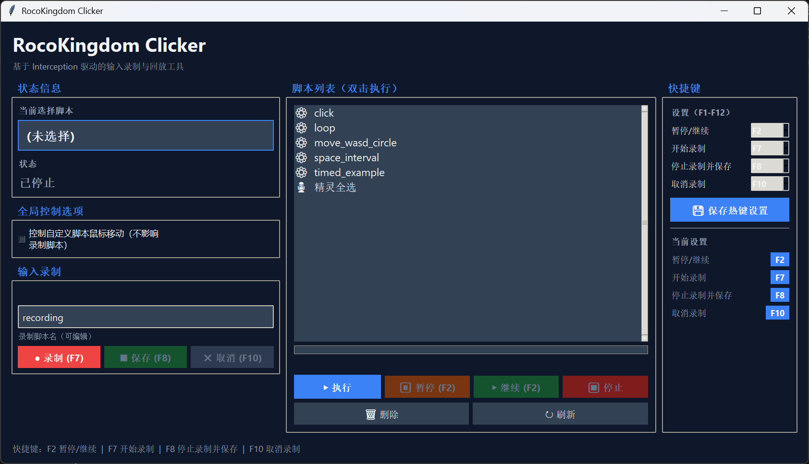
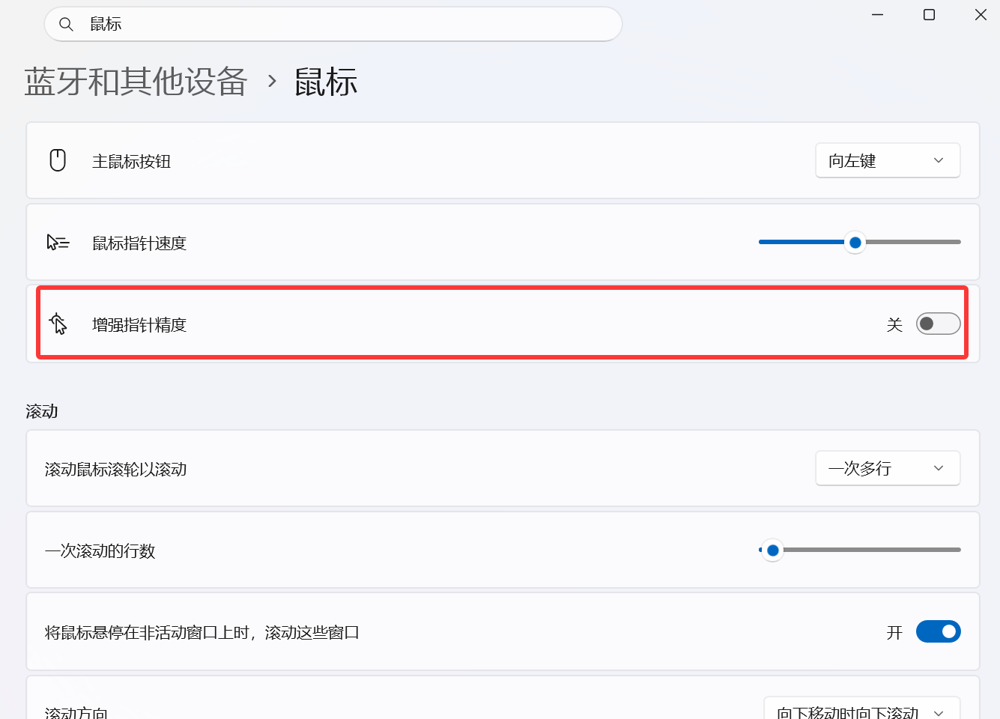

# RocoKingdom 连点器（RocoKingdom Clicker）

本项目用于在《洛克王国：世界》中自动执行重复、固定的鼠标/按键动作，以减少玩家手动重复操作的负担。

> 请注意：使用自动化工具存在被封禁的风险，使用者须自行承担风险与后果。

## 启动与运行

### 前置步骤：安装驱动（只需一次）

本程序靠 **Interception 驱动**模拟鼠标，首次使用需要装一次驱动（仓库已附带编译好的 DLL 与安装程序，**不需要自己安装 WDK 或编译 DLL**）。

推荐直接双击程序：如果驱动没装，程序会自己弹框问「是否现在自动安装」，点「是」→ 过一次 UAC → 装完问你是否立即重启，全程不用敲任何命令。也可以双击包里的 `install_driver.bat` 单独装。

手动安装的完整步骤见 [驱动安装说明](docs/DRIVER_INSTALLATION.md)。

### 使用发布包运行

下载并【完整解压】发布包后，直接双击 `RocoKingdom_Clicker.exe` 即可。

该 exe 由 PyInstaller `--uac-admin` 打包，已内嵌 `requireAdministrator` 清单，**双击就会自动弹 UAC 提权**，不需要任何启动脚本，也没有控制台窗口。

> 旧版本靠 `run_clicker.vbs` 弹 UAC，现已移除：Windows 11 25H2 起 VBScript 被列为「按需功能」并默认关闭，双击 `.vbs` 可能直接没反应。

包内还附带两个可选脚本：

| 文件 | 用途 |
| --- | --- |
| `install_driver.bat` | 单独一键安装（或 `/uninstall` 卸载）驱动；实际调 `RocoKingdom_Clicker.exe --install-driver`，提示与程序内完全一致 |
| `run_clicker.bat` | 兼容用启动器；源码开发环境下用它提权跑 `Clicker.py` |

### 开发与调试（源码运行）

当你需要修改代码、调试或查看详细日志时，使用源码运行：

```bat
python Clicker.py --gui
```

备用（会显示控制台）：

```bat
run_clicker.bat
```

开发运行注意事项：

- 需要在运行机器上安装 Python（推荐 3.10）。
- 跑测试（纯标准库，不需要装 pytest；MIDI 解析与演奏引擎不依赖驱动，无需管理员权限）：

```bat
python -m unittest discover -s tests -v
```

### 执行脚本



上图为软件的用户界面：

- **左栏**：分三组独立面板
  - **状态信息**：显示当前选择脚本和运行状态（运行中/已暂停/已停止/倒计时等）。
  - **全局控制选项**：控制自定义脚本鼠标移动的开关。
  - **输入录制**：录制名输入框 + 录制/保存/取消按钮。
- **中栏（脚本列表）**：显示 `data/action_scripts/` 下的脚本文件（`⚙` 动作脚本 / `🎙` 录制脚本），点击选择脚本，双击直接执行。下方按钮区：`▶ 执行` / `⏸ 暂停` / `▶ 继续` / `⏹ 停止` / `🗑 删除` / `↻ 刷新`。
- **右栏（快捷键 + 路径算法）**：可自定义 F1-F12 热键设置区 + 当前设置彩色徽章显示；下方为「拟人化路径算法」的策略与参数配置。
- **第四栏（窗口区域连点）**：四组面板
  - **目标区域**：区域预设下拉（存为预设 / 删除）、X/Y/宽/高手输框、`📐 拖拽圈选` / `🪟 拾取窗口` 两个按钮。
  - **点击参数**：每点点击次数、点击间隔、按住时长、落点抖动 X/Y、总点击次数与无限循环开关（均支持 ± 扰动）。
  - **移动参数**：移动耗时、路径步数、最小点距、区域内边距、换点停顿、漂移校正阈值、路径策略与鼠标按键。
  - **运行控制**：`▶ 开始窗口连点` / `⏸ 暂停` / `▶ 继续` / `⏹ 停止` / `💾 保存参数` / `💾 存为脚本`，并实时显示已点击与已换点次数。
- **第五栏（MIDI 自动演奏）**：四组面板
  - **曲谱库**：列出 `data/music/` 下的全部 MIDI（启动时自动读取），`📂 导入 MIDI` / `↻ 刷新` / `🗑 删除`。
  - **键位绑定**：九键徽章一览 + 音域提示，`✏ 编辑键位` 打开增删改对话框，`↺ 恢复默认` 回到出厂键位。
  - **曲谱检查**：移调（半音）与自动移调开关；检查结论、曲谱摘要，以及缺失音的逐条明细。
  - **演奏控制**：速度 / 按键保持 / 倒计时 / 循环次数 / 每轮间隔 / 最多同时按键，`▶ 开始演奏`、暂停继续停止、进度条与 `💾 保存演奏参数`。

### MIDI 自动演奏

给定一套「音 → 键盘按键」的绑定，把任意 MIDI 曲谱按原速自动弹出来：

- **曲谱库**：把 `.mid` / `.midi` 放进 `data/music/`，或在面板里点 `📂 导入 MIDI`（复制进来，重名自动加序号）。程序启动即自动列出，选中即自动检查。
- **曲谱从哪来**：推荐 [RocoMusic（洛克乐谱）](https://rocomusic.cn/)——面向《洛克王国》玩家的非官方 MIDI 曲谱社区，另有「求谱广场」与「手碟转谱」。本项目默认键位就是《洛克王国：世界》手碟九键，那边的谱子基本可以直接演奏，不必自己重排键位。发布包附带 6 首来自该站的示例曲谱（清单与版权说明见 [data/music/README.md](data/music/README.md)），版权归原作者与转录者所有。
- **能不能演奏，先说清楚**：曲谱里出现的每个音都必须在键位表里有按键，才允许开演。缺音时面板会逐条列出「哪个音、出现几次、首次在第几秒、最接近的已绑定音是哪个、差几个半音」，`▶` 按钮变成 `⚠ 无法演奏 · 查看原因`，点下去弹出完整清单——不会静默跳过几个音就开演。
- **移调**：音域不合时可以用「移调」整体平移；勾上「自动移调」后，若原调演奏不了，会自动挑一个**能覆盖全部音符且移调量最小**的方案。半音阶这类谱子没有任何移调量能救，面板会直接说明。
- **键位可改**：默认是《洛克王国：世界》手碟九键（`A2→B`、`E3→F`、`F3→G`、`G3→H`、`A3→J`、`B3→K`、`C4→T`、`D4→Y`、`E4→U`，中央 C = 60 = C4）。`✏ 编辑键位` 可以改按键、删绑定、按音名（`C#4` / `Db4`）或 MIDI 音高数字新增绑定；保存时校验按键合法性与一键多音冲突。
- **同键重叠会自动重触发**：一个键被按住时再按不会发声，所以同一个键上的音符重叠时，引擎会提前 12ms 抬手再按下，保证每个音都真的触发一次。间隔短到做不到时会记进日志。
- **时序**：按绝对时间轴调度（不是累加 sleep，误差不会随音符数漂移），演奏期间把系统时钟精度提到 1ms，结束后还原。速度倍率 10%~400%。
- **按键注入**：走 Interception 内核驱动（与脚本系统同一条通道），失败才回退 `keybd_event`。任何退出路径（播完 / 暂停 / 停止 / 异常）都会抬起所有按住的键，不会留下卡键。
- **互斥与热键**：演奏与脚本、回放、录制互斥；演奏期间 `F2` 暂停/继续，其余热键被忽略（注入的按键同样会被键盘钩子看到，否则绑到 F 功能键的音符会误触发录制）。倒计时阶段按 `F2` 直接取消。
- **倒计时**：默认 3 秒，用来切到游戏窗口。
- **纯标准库**：MIDI 解析自己实现（`MidiScore.py`），不引入 mido / python-midi，运行期依赖与打包体积都不变。

参数持久化在 `data/clicker_configs/music_player.json`（运行时生成，不入库）。其中 `min_hold_ms`（最短按住时长，默认 45ms）和 `retrigger_gap_ms`（同键重触发间隔，默认 12ms）不在面板上，改文件即可生效——游戏识别不到短音时把 `min_hold_ms` 调大。

### 窗口区域连点

针对“在一个窗口范围内随机点击”的需求：给定一个屏幕矩形区域，鼠标在区域内随机取点 → 在该点连点 N 次（带完整抖动）→ 用拟人化轨迹移动到下一个随机点 → 循环。

- **区域录制**：`📐 拖拽圈选` 会铺满整个虚拟屏（支持多显示器负坐标），拖框即得矩形；`🪟 拾取窗口` 倒计时 3 秒后自动取光标下窗口的可视边界（DWM 扩展边界，不包含阴影）。`Esc` / 右键取消。
- **区域预设**：圈选结果可命名保存为预设（`data/clicker_configs/region_presets.json`），下次直接下拉选用；手写脚本也可用 `"region_preset": "预设名"` 引用。
- **两个入口，一套互斥规则**：`📐 拖拽圈选`（= `F6`，按钮上会显示热键名）、`🪟 拾取窗口` 以及 `F6` 热键本身，全部经过 `ClickerManager.request_region_capture()` 同一条路径。**录制中 / 脚本运行中 / 回放中 / MIDI 演奏中一律拒绝并提示**，不会把全屏覆盖层盖到游戏上。
- **路径算法**：点与点之间的移动复用第三栏的 `PathPlanner`（`sine` / `fitts` / `neuromotor` / `straight`），也可在第四栏单独指定策略（`global` = 跟随第三栏）。
- **相对注入**：全程只发相对位移，不使用绝对坐标，因此多显示器与光标锁定场景都能正常工作，也**不受**全局 `move_mouse` 开关影响（启动时会 toast 说明）。
- **可中断**：运行中 `F2` 暂停 / 继续、第四栏或中栏的停止按钮均全程生效。
- **运行时显示区域边框**：勾上「🔲 运行时显示区域边框」后，连点期间区域四周会常驻一圈青色边框，方便确认鼠标确实落在预期范围内。边框**完全点击穿透**——画在区域外侧、Tk `-transparentcolor` 颜色键、`WS_EX_TRANSPARENT` 三层保障叠在一起，注入的点击照常打到游戏，不会被覆盖层吃掉；万一三层全都失效，程序宁可不显示也不会放一个会吞点击的窗口上去（会 toast 提示一次）。独占全屏游戏里可能画不出来。该开关是纯显示偏好，不写进配置文件，每次启动默认打开。
- **存为脚本**：`💾 存为脚本` 会把当前面板参数落盘为 `data/action_scripts/{名字}.json`，之后可直接在中栏列表里执行。

### 暂停/继续/停止

所有脚本（录制回放 + 自定义动作脚本）均支持暂停、继续、停止：

- **暂停**：运行中点击暂停按钮或按暂停热键，脚本挂起但保留进度。
- **继续**：暂停中点击继续按钮或再按一次暂停热键，倒计时 3 秒后恢复执行。
- **停止**：直接终止当前脚本，不保留进度。
- **切换确认**：脚本暂停时若点击列表切换到其他脚本，会弹出确认框，确认后停止当前脚本（不保留进度）再切换。

### 可自定义热键（F1-F12）

四个功能热键全部支持用户自定义，范围 F1-F12，防止系统占用用户想录制的按键。默认配置：

| 功能 | 默认按键 |
|------|---------|
| 暂停/继续 | F2 |
| 录制区域（圈选） | F6 |
| 开始录制 | F7 |
| 停止录制并保存 | F8 |
| 取消录制 | F9 |
| 标记锚点（录制中） | F12 |

在右栏快捷键面板的下拉框中修改后点击"保存热键设置"即可。配置持久化到 `data/clicker_configs/hotkeys.json`，重启后生效。不同功能不能使用同一个按键，冲突时会提示具体冲突按键。

注意：热键监听使用全局键盘钩子（WH_KEYBOARD_LL），记录按键事件但不拦截原按键，因此游戏的原生按键功能仍然保留。

### 鼠标锚点路径扰动

> **前置要求**：Windows 设置 → 蓝牙和其他设备 → 鼠标 → **增强指针精度** 必须为 **关**。
> 该选项开启时 Windows 会对鼠标增量施加非线性加速，导致路径扰动策略回放后的实际屏幕位移与原始录制不一致（锚点位置偏移）。关闭后 Interception 注入的相对增量将 1:1 对应屏幕像素移动，锚点精度才有保障。



录制过程中按锚点热键（默认 F12）可标记锚点位置。回放时鼠标会走不同的路径，但最终到达的位置与原始录制完全一致：

- **每轮回放路径不同**：模拟真人操作的不确定性，降低被检测风险
- **锚点位置零偏差**：每个锚点处的累积位移与原始录制精确一致，有数学保证
- **三种路径策略可切换**：
  - `sine`：正弦垂直扰动，平滑弧线
  - `fitts`：拟人化路径（平滑低频噪声 + 弧线 + 过冲修正），更接近真人操作
  - `neuromotor`：间歇预测控制模型（间歇子运动链 + 感知噪声重规划 + Lognormal速度脉冲 + 熵控随机），基于 CHI 2021 / 2024-2025 顶会研究
- 锚点热键可在快捷键面板中自定义（F1-F12）

## 脚本系统
- 脚本文件位于 `data/action_scripts/`，请按 `SCRIPT_RULES.md` 的格式编写动作序列。
- 新增动作类型：`timed`，用于在脚本内部指定"运行时长后停止/退出"或其它定时条件。
- 新增动作类型：`region_click`，用于在一个矩形区域内随机取点连点并用拟人轨迹在点间移动（对应 GUI 第四栏）。
- 支持动作类型：`click`, `move`, `key`, `combo`, `wait`, `loop`, `timed`, `region_click`。
- 类人化选项（抖动）：`x_jitter_px`, `y_jitter_px`, `hold_jitter_ms`, `duration_jitter_ms`, `pause_jitter_ms`；`region_click` 额外提供 `clicks_per_spot_jitter`, `interval_jitter_ms`, `move_duration_jitter_ms`, `spot_pause_jitter_ms`。

录制脚本：
- 通过左栏"输入录制"区录制鼠标移动/点击/键盘事件，保存后生成 `meta.type="recorded"` 的脚本文件。
- 文件名格式：`{用户输入名}_{日期}_{时间}.json`，例如 `我的测试_20260623_235229.json`。
- 录制脚本与动作脚本统一显示在脚本列表中（`🎙` 图标区分），双击即可回放。

行为细节：
- 全局 `move_mouse` 配置控制 `click` 是否移动鼠标；若 `move_mouse=false`，`click` 只发送按下/释放事件，不会移动鼠标；GUI 中会显示 `ignored_moves`（因全局禁止而被忽略的移动次数）。

示例（简要）：

```json
{
  "name": "example_loop",
  "actions": [
    {"type": "loop", "count": 0, "actions": [
      {"type": "move", "x": 900, "y": 500, "duration_ms": 120},
      {"type": "click", "x": 900, "y": 500, "hold_ms": 80},
      {"type": "wait", "duration_ms": 300}
    ]}
  ]
}
```

更多示例与规范请参阅 `data/action_scripts/SCRIPT_RULES.md`。

仓库内示例脚本概览

以下为 `data/action_scripts/` 目录下自带脚本的简要说明，便于快速理解和测试：

- `click.json` (`script_0`)
  - 说明：基于 `timed` 的周期性点击示例。每个执行窗口（60s）内不断执行一次点击+短等待，然后休眠 1s 后重复（`forever: true`）。包含坐标抖动与按压抖动，模拟更类人的点击行为。
  - 用途：适合需要周期性短时连续点击的场景。通过 GUI 选择并执行该脚本。

- `loop.json` (`script_1`)
  - 说明：无限循环的基础连点示例。每轮移动到固定坐标、点击并等待 300ms，`count:0` 表示一直循环直到用户停止脚本（通过 GUI 停止）。
  - 用途：用于持续的单点点击循环测试或替代简单连点器行为。

- `move_wasd_circle.json` (`move_wasd_circle`)
  - 说明：通过 `combo` 动作模拟 WASD 转圈（W+D, D+S, S+A, A+W）并在每步加入等待与抖动，适合需要持续移动的场景（例如游戏内挂机移动）。
  - 用途：测试键盘组合动作、移动类脚本或自动走位场景。

- `space_interval.json` (`space_interval`)
  - 说明：按空格键（VK 32）并定期等待约 1.5s 的循环示例，带微小抖动。用于需要定期按键触发的场景（例如间隔触发技能/互动）。
  - 用途：节奏型按键测试或模拟周期性空格输入场景。

- `timed_example.json` (`timed_example`)
  - 说明：`timed` 示例：执行窗口 5s、休眠 2s、重复 2 次；在每个执行窗口内以 `loop` 连续点击并等待，用于展示 `timed` 的基本用法。
  - 用途：学习如何使用 `timed` 包装器实现“工作窗口 + 休眠窗口”的运行模式。

- `region_click.json` (`窗口区域连点示例`)
  - 说明：`region_click` 完整字段示例：在 `(100,200)` 的 800x600 区域内每点点击 3±1 次，点击间隔 120±40ms，按住 80±30ms，换点移动 220±60ms，无限循环。
  - 用途：学习手写窗口区域连点脚本；把 `region` 换成自己的窗口矩形即可直接使用。

使用提示：在 GUI 中可以直接选择并运行上述脚本；热键支持自定义（见"可自定义热键"章节），默认 F7 开始录制、F8 停止保存、F9 取消录制、F6 录制窗口区域、F2 暂停/继续。

详细动作说明（快速参考）

- `click`：移动到 `(x,y)` 并单次点击。
  - 字段：`type: "click"`, `x`, `y`, 可选 `hold_ms`（默认 ~100ms）。
  - 注意：当全局 `move_mouse=false` 时，仅发送按下/释放事件，不移动鼠标。

- `move`：移动到 `(x,y)`，不点击。
  - 字段：`type: "move"`, `x`, `y`, 可选 `duration_ms`（移动耗时，默认 ~100ms）。

- `key`：按下并释放单键。
  - 字段：`type: "key"`, `vk_code`（虚拟键码）, 可选 `hold_ms`（默认 ~50ms）。

- `combo`：同时按下一组按键（用于 WASD 转圈等）。
  - 字段：`type: "combo"`, `vk_codes`（数组）, 可选 `hold_ms`, `hold_jitter_ms`。

- `wait`：静默等待。
  - 字段：`type: "wait"`, `duration_ms`, 可选 `duration_jitter_ms`。

- `loop`：循环执行一组动作。
  - 字段：`type: "loop"`, `actions`（数组）, `count`（次数），或 `forever: true` 表示无限循环直到用户停止脚本（通过 GUI 停止）。
  - 可选 `pause_ms` 与 `pause_jitter_ms` 控制每轮间隔。

- `timed`：在“执行窗口”内重复运行一组动作，窗口到期后进入休眠，再根据 `repeat`/`forever` 决定是否重试。
  - 字段：`type: "timed"`, `execute_ms`（执行窗口 ms）, `sleep_ms`（休眠 ms）, `actions`（在执行窗口内的动作数组），可选 `repeat` 或 `forever`。
  - 行为要点：执行窗口计时会在脚本被暂停时暂停；若某次内部动作超出窗口，动作会完成后再判断是否到期。

- `region_click`：在一个矩形区域内随机取点连点，点间用拟人化轨迹移动（全程相对位移注入）。
  - 区域三选一：`region: {x,y,width,height}`、扁平的 `region_x/region_y/region_width/region_height`、或 `region_preset: "预设名"`。
  - 常用字段：`clicks`（0=不限）, `forever`, `clicks_per_spot`(+`_jitter`), `interval_ms`(+`_jitter_ms`), `hold_ms`(+`_jitter_ms`), `move_duration_ms`(+`_jitter_ms`), `margin_px`, `min_spot_distance_px`, `x_jitter_px`/`y_jitter_px`, `spot_pause_ms`(+`_jitter_ms`), `path_strategy`, `path_steps`, `button`, `correct_drift_px`, `path_params`。
  - 行为要点：`path_strategy: "global"` 跟随 GUI 第三栏的路径算法配置；不受全局 `move_mouse` 开关影响；宽或高 ≤ 0 时该动作被忽略并记 warning。

快速示例（timed）：

```json
{
  "type": "timed",
  "execute_ms": 300000,
  "sleep_ms": 300000,
  "forever": true,
  "actions": [
    { "type": "click", "x": 900, "y": 500, "hold_ms": 80 },
    { "type": "wait", "duration_ms": 100 }
  ]
}
```

编写建议：
- 把常驻流程放入 `loop`（`count:0` 或 `forever:true`），便于通过 GUI 的停止按钮或热键停止，或脚本内部条件结束（`timed`）。
- 需要快速触发的流程，请在 GUI 中将其放在显著位置并使用"执行"按钮进行触发。

更多完整字段与示例请参阅仓库：`data/action_scripts/SCRIPT_RULES.md`。

## 打包与发布
- 生成发布包：在项目根目录运行：

```bat
.\build_release.bat
```

- 构建脚本要点：使用 `PyInstaller --onedir --windowed --uac-admin` 生成无控制台窗口、**双击即自动弹 UAC** 的发布目录（`--uac-admin` 就是 `run_clicker.vbs` 的替代品），并把 `run_clicker.bat` / `install_driver.bat` 复制进 `dist\\RocoKingdom_Clicker`（同时包含示例脚本与默认配置）。
- **三个 `.bat`（`build_release.bat` / `run_clicker.bat` / `install_driver.bat`）必须保持纯 ASCII，不要往里加中文。** cmd.exe 按字符数而不是字节数推进批处理文件的读取位置，含多字节字符的行会被错位解析，行尾被当成命令执行（实测：一行中文 `rem` 注释报 `'venv' is not recognized as an internal or external command`）。面向用户的中文提示一律放在 `DriverInstaller.py` 的消息框里。

## 调试与常见问题
- 如果在游戏中无法捕获热键，确认程序是**以管理员身份**运行的（发布包 exe 已内嵌提权清单，源码运行请走 `run_clicker.bat`）。
- 启动时弹「驱动未就绪」：点「是」让程序自动装驱动，装完**必须重启电脑**；若已装过驱动仍报错，通常就是还没重启。也可单独跑 `install_driver.bat`。
- 提示「找不到 interception.dll」：这是发布包不完整，重装驱动没用，请重新下载并【完整解压】（不要在压缩包内直接双击）。
- 要查看详细日志，可在开发模式下运行 `python Clicker.py`（不加 `--gui`）以输出控制台日志。
- 热键配置失效或想恢复默认：删除 `data/clicker_configs/hotkeys.json` 后重启程序即可恢复默认配置（F2 暂停/继续、F6 录制区域、F7 开始录制、F8 停止保存、F9 取消、F12 标记锚点）。
- 修改热键后按钮 label 会自动更新（如 `⏸ 暂停 (F3)`）；若未更新，点击"保存热键设置"按钮触发刷新。

## 更新日志与贡献
- **发布说明**（按版本聚合，可直接作为 GitHub Release 正文）：[docs/releases/v1.7.md](docs/releases/v1.7.md)
- 最新变更记录请见：[docs/changelog/2026-10-03.md](docs/changelog/2026-10-03.md)
- 历史变更：[2026-10-01](docs/changelog/2026-10-01.md) | [2026-09-30](docs/changelog/2026-09-30.md) | [2026-09-28](docs/changelog/2026-09-28.md) | [2026-09-27](docs/changelog/2026-09-27.md) | [2026-08-01](docs/changelog/2026-08-01.md) | [2026-07-20](docs/changelog/2026-07-20.md) | [2026-06-29](docs/changelog/2026-06-29.md) | [2026-06-21](docs/changelog/2026-06-21.md) | [2026-05-31](docs/changelog/2026-05-31.md)
- 欢迎提交 issue 或 PR，描述你的使用场景与复现步骤。

---

## 交流与支持

扫码加入 QQ 交流群，获取最新版本、反馈问题或分享脚本：


群号：1105254591

> 风险提示：本工具可能会违反游戏使用条款或遭受反作弊检测。请仅在你愿意承担风险的情况下使用。

## 致谢与参考文献

本项目的 `neuromotor` 拟人化路径生成策略基于以下 2021-2025 顶会前沿研究实现：

1. **Do, S., Chang, M., & Lee, B. (2021).** A Simulation Model of Intermittently Controlled Point-and-Click Behaviour. *CHI '21*. [DOI](https://doi.org/10.1145/3411764.3445514)
   — BUMP 模型：间歇控制 + 弹道子运动 + 感知更新

2. **Klar, M., et al. (2025).** An Active Inference Model of Mouse Point-and-Click Behaviour. *arXiv:2510.14611*. [Link](https://arxiv.org/abs/2510.14611)
   — 主动推理 + 感知延迟 + 不确定性驱动修正

3. **Rudakov, E., et al. (2025).** SSSUMO: Real-Time Semi-Supervised Submovement Decomposition. *arXiv:2507.08028*. [Link](https://arxiv.org/abs/2507.08028)
   — Lognormal 速度脉冲 + 2-3 Hz 子运动节律

4. **Liu, J., et al. (2024).** DMTG: A Human-Like Mouse Trajectory Generation Bot Based on Entropy-Controlled Diffusion Networks. *arXiv:2410.18233*. [Link](https://arxiv.org/abs/2410.18233)
   — 熵控扩散模型，相位自适应随机性

经典理论基础：

- Flash & Hogan (1985): Minimum Jerk 模型, *J. Neuroscience* 5(7)
- Harris & Wolpert (1998): 信号依赖噪声, *Nature* 394
- Plamondon (1995): Sigma-Lognormal 运动学, *Biol. Cybernetics* 72(4)

参考开源实现：

- [AIF-Pointing](https://github.com/mkl4r/AIF-Pointing) — 主动推理鼠标指向模拟 (Python/JAX)
- [mouse-ai](https://github.com/SaluRamos/mouse-ai) — DMTG 扩散模型鼠标轨迹 (Python)
- [SigmaDrift](https://github.com/ck0i/SigmaDrift) — 生物力学鼠标轨迹生成 (C++20)
- [WindMouse](https://ben.land/post/2021/04/25/windmouse-human-mouse-movement/) — 物理模拟拟人鼠标移动 (GPLv3)

曲谱资源：

- [RocoMusic（洛克乐谱）](https://rocomusic.cn/) — 面向《洛克王国》玩家的非官方 MIDI 曲谱社区；`data/music/` 附带的示例曲谱来自该站，版权归原作者与转录者所有

## 许可协议 (Licensing)

本项目的**原创代码**（项目根目录下的 `*.py`、`*.bat`、`*.md`、`data/`、`docs/` 等非第三方的非二进制文件）采用 **MIT License** 发布，完整文本见 [LICENSE](LICENSE)。

本项目**动态链接**了第三方库 **Interception**（<https://github.com/oblitum/Interception>），该库采用 **GNU Lesser General Public License, version 3 (LGPL-3.0)** 授权。Interception 的库文件位于 `third/Interception/`，其原始许可证文件位于 `third/Interception/licenses/`，同时本仓库根目录也附带了完整许可证文本：

- `COPYING` — GNU General Public License, version 3（GPL-3.0）
- `COPYING.LESSER` — GNU Lesser General Public License, version 3（LGPL-3.0）

根据 LGPL-3.0 第 4 条要求，特此声明：

1. 本项目中的 `interception.dll`、`interception.lib`、`interception.h` 及驱动安装程序均为 **Interception 项目原样提供的原始二进制文件**，未作任何修改；本项目只是调用其 DLL 导出函数。
2. Interception 的源代码和官方发布版本可从其上游仓库获取：<https://github.com/oblitum/Interception/releases>
3. 本项目的 **原创代码**（不包含 `third/Interception/` 下的任何内容）继续以 **MIT License** 独立发布；用户可按自己的需要替换、重新编译或使用其他版本的 Interception DLL。
4. 若你分发本项目（含 `interception.dll`），请确保 `LICENSE`、`COPYING`、`COPYING.LESSER` 与 `third/Interception/licenses/` 下原始许可证文本**一并分发**，并在分发说明中注明项目使用了 Interception 库。
5. 商业使用：Interception 另提供商业授权许可，详见 `third/Interception/licenses/commercial-usage/` 下的 PDF 文档。如果你希望在商业产品中使用 Interception 而不受 LGPL 约束，请联系 Interception 的原作者。
