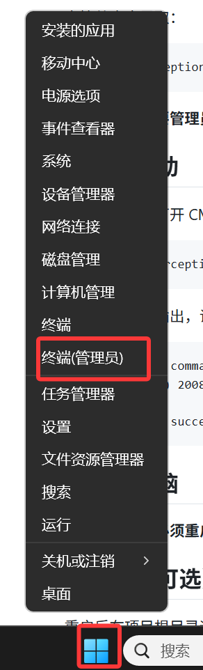

# 安装 Interception 驱动

本仓库在 `third/Interception/` 目录下已经提供了官方编译好的 `interception.dll`（x64 / x86 各一份）以及驱动安装工具，因此**不需要自行安装 Windows Driver Kit，也不需要自己编译 DLL**。

你只需要做两件事：安装驱动 → 重启电脑。

## 1. 定位驱动安装程序

根据你拿到的是发布包还是源码，使用对应的路径：

### 发布包用户（release zip）
解压后，安装程序位于：

```
driver_installer\install-interception.exe
```

### 源码开发者
直接从仓库里取：

```
third\Interception\command line installer\install-interception.exe
```

运行该程序**需要管理员权限**。

## 2. 安装驱动

以**管理员权限**打开 CMD 或 PowerShell，进入安装程序所在目录后执行：



```bat
./install-interception.exe /install
```

如果看到以下输出，说明驱动安装成功：

```
Interception command line installation tool
Copyright (C) 2008-2018 Francisco Lopes da Silva

Interception successfully installed. You must reboot for it to take effect.
```

## 3. 重启电脑

安装驱动后，**必须重启系统**才能生效。

## 4. 验证（可选）

重启后在项目根目录运行：

```bat
python Clicker.py --gui
```

或双击 `run_clicker.vbs`。如果能正常启动 GUI 并显示“连点器已就绪”等日志，说明 Interception 库加载成功。

如果启动时提示“无法加载 interception.dll”，请检查：

1. 驱动是否已完成安装并重启。
2. 发布包用户：确认解压目录里有 `interception.dll`（与 `RocoKingdom_Clicker.exe` 同目录）。
3. 源码用户：确认 `third\Interception\library\x64\interception.dll` 存在（64 位 Python 会优先使用它；若你使用 32 位 Python，程序会自动尝试 `third\Interception\library\x86\interception.dll`）。

## 5. 卸载驱动（如需）

如果之后想移除驱动，同样以管理员权限进入同一目录并执行：

```bat
./install-interception.exe /uninstall
```

然后重启系统即可。
