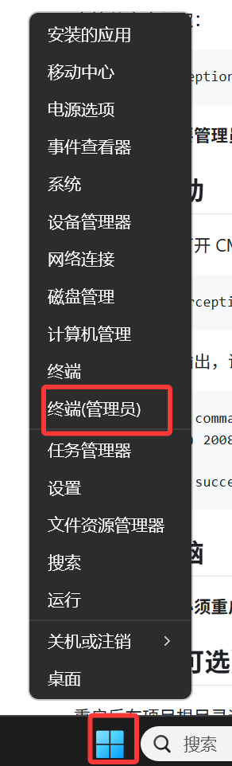

# 安装 Interception 驱动

本程序靠 **Interception 驱动**（键鼠类过滤驱动）模拟鼠标点击，首次使用需要装一次驱动，装完**必须重启电脑**。

仓库在 `third/Interception/` 下已经提供了官方编译好的 `interception.dll`（x64 / x86 各一份）以及驱动安装工具，因此**不需要自行安装 Windows Driver Kit，也不需要自己编译 DLL**。

---

## 方式一：程序内一键安装（推荐）

直接双击运行 `RocoKingdom_Clicker.exe`。

如果检测到驱动没装好，程序会弹出对话框：

```
RocoKingdom Clicker 需要 Interception 驱动才能模拟鼠标点击。
检测到驱动【尚未安装】，是否现在自动安装？
```

点「**是**」后：

1. 可能弹一次 UAC 提权窗口 → 点「是」
2. 程序静默调用官方 `install-interception.exe /install`，约几秒钟
3. 装完再问「是否立即重启电脑」→ 选「是」会 15 秒倒计时重启（期间可用 `shutdown /a` 取消），选「否」则稍后自己重启

全程不需要打开终端、不需要敲任何命令。

> 发布包的 exe 由 PyInstaller `--uac-admin` 打包，已内嵌 `requireAdministrator` 清单，双击即提权，所以大多数情况下连 UAC 都只弹一次。

## 方式二：`install_driver.bat`

不想先启动主程序的话，双击包里的 `install_driver.bat`：

- 自动请求管理员权限（用 PowerShell `Start-Process -Verb RunAs` 把自己重新拉起，**不依赖 `.vbs`**）
- 自动定位安装器：先找 `driver_installer\install-interception.exe`，再退回源码仓库的 `third\Interception\command line installer\install-interception.exe`
- 先打印当前驱动状态（区分「未安装」和「已安装但没重启」）
- 把安装器输出原样显示出来，失败时给出排查方向
- 成功后用 `choice` 问是否立即重启

卸载驱动：

```bat
install_driver.bat /uninstall
```

## 方式三：纯手动

### 1. 定位安装程序

| 你拿到的是 | 安装程序路径 |
| --- | --- |
| 发布包（release zip） | `driver_installer\install-interception.exe` |
| 源码仓库 | `third\Interception\command line installer\install-interception.exe` |

运行该程序**需要管理员权限**。

### 2. 执行安装

以**管理员权限**打开 CMD 或 PowerShell，进入安装程序所在目录后执行：



```bat
./install-interception.exe /install
```

看到以下输出说明安装成功：

```
Interception command line installation tool
Copyright (C) 2008-2018 Francisco Lopes da Silva

Interception successfully installed. You must reboot for it to take effect.
```

### 3. 重启电脑

安装驱动后，**必须重启系统**才能生效。

### 4. 卸载（如需）

同样以管理员权限进入同一目录执行：

```bat
./install-interception.exe /uninstall
```

然后重启系统。

---

## 验证

重启后双击 `RocoKingdom_Clicker.exe`（源码用户：`python Clicker.py --gui`）。能正常进入界面、状态栏显示 Interception 就绪，说明驱动与 DLL 都加载成功。

也可以在源码目录下用命令行查状态（只读，不改系统）：

```bat
python DriverInstaller.py --status
```

输出示例：

```
Interception 驱动状态：
  已安装（注册表痕迹）: True
    keyboard_filter    = True
    mouse_filter       = True
    keyboard_service   = True
    mouse_service      = True
    mouse_driver_file  = True
  当前进程管理员权限  : False
  安装器路径          : ...\third\Interception\command line installer\install-interception.exe
```

## 排查

### 提示「找不到或无法加载 interception.dll」

这**不是驱动问题**，重装驱动修不好。原因是程序文件不完整：

1. 发布包用户：重新下载并**完整解压**到同一目录，确认 `interception.dll` 与 `RocoKingdom_Clicker.exe` 同级（不要在压缩包里直接双击运行）。
2. 源码用户：确认 `third\Interception\library\x64\interception.dll` 存在（64 位 Python 优先用它；32 位 Python 会自动尝试 `x86` 那份）。
3. 位数不匹配也会加载失败：32 位 Python 加载 64 位 DLL 会直接报错。

### 提示「无法创建上下文 / 驱动未就绪」

按可能性排序：

1. **装完还没重启** —— 最常见，重启即可。
2. 驱动确实没装成功 —— 重跑一次 `install_driver.bat`，看它打印的安装器输出。
3. 安全软件 / 反作弊拦下了驱动写入 —— 看安装器输出里有没有 `Access is denied` 之类。
4. Windows 11 25H2 开启了「内存完整性」（核心隔离）等驱动加固策略时，未签名的旧驱动可能被拒载。

### 「装了驱动但检测说没装」

`sc query interception` **永远查不到**这个驱动，这是正常的：Interception 以键盘/鼠标**类过滤驱动**形式安装，服务名就叫 `keyboard` 和 `mouse`，并没有名为 `interception` 的服务。

`DriverInstaller.py` 的检测因此改用三个可靠信号（读 HKLM，不需要管理员权限）：

- 类键 `UpperFilters` 是否含 `mouse` / `keyboard`
  - 鼠标类：`HKLM\SYSTEM\CurrentControlSet\Control\Class\{4D36E96F-E325-11CE-BFC1-08002BE10318}`
  - 键盘类：`HKLM\SYSTEM\CurrentControlSet\Control\Class\{4D36E96B-E325-11CE-BFC1-08002BE10318}`
- `HKLM\SYSTEM\CurrentControlSet\Services\mouse`（及 `keyboard`）键是否存在
- `%SystemRoot%\System32\drivers\mouse.sys` 是否落地

装好后前两项应分别为 `mouse\0mouclass` / `keyboard\0kbdclass`。

### 提示「驱动已就绪，但没有发现任何鼠标设备」

说明驱动没问题，是 Interception 在鼠标槽位（11~20）里没找到挂着硬件的设备。确认鼠标 / 触摸板已连接并被系统识别，然后重新运行程序。这种情况**不需要**重装驱动。
